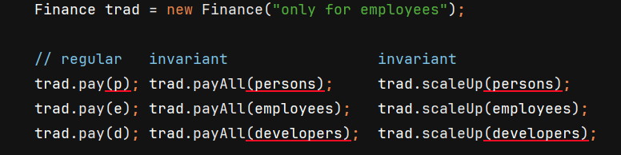
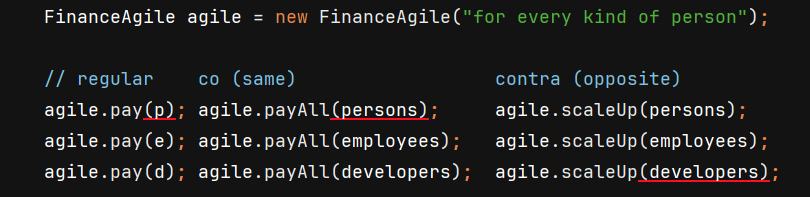

## Variance
<!-- .slide: class="is-fancy2" -->


---

### Variance
- Given the generic type `List<T>`
  - `List` is a _container_ for `T`.

> How does a _generic_ type behave when used as a method parameter?

---
 
### Subtypes and generics
`Developer` is a sub**type** of `Employee`.

Is `List<Developer>` also a sub**type** of `List<Employee>`?

---

### Subtypes and generics

- Given this method:
    ```java
    class Finance {  
       void payAll(List<Employee> e) { /*...*/ }	
    }
    ```
- Are these calls allowed? <!-- .element: class="fragment" -->
	```java
    f.payAll(employees);  // employees is a  List<Employee>
    f.payAll(developers); // developers is a List<Developers>
    ```
   - Your gut feeling says...? <!-- .element: class="fragment" -->
- No ❌! The second call gives: <!-- .element: class="fragment" -->
  ```console
  incompatible types: 
     List<Developer> cannot be converted to List<Employee>
  ```
- So: <!-- .element: class="fragment" -->
  - `List<Developer>` is NOT a subtype of `List<Employee>`!	
  - `List<T>` is **invariant**

---

### Subtypes and generics
- Why is that?  
- Because <!-- .element: class="fragment" --> we can _do things_ with the _contents_ of the container: 
    ```java [2|6|]
    void payAll(List<Employee> es) {
         for (Employee e : es) {    // read Employee ✅
             e.pay();    
         }               
  
        es.add(new ProductOwner()); // write Employee ✅
    }
    ```
   - perfectly <!-- .element: class="fragment" --> valid code _in this context_ 
- If <!-- .element: class="fragment" --> calling `f.payAll(developers)` was allowed...
  - ... a <!-- .element: class="fragment" --> `ProductOwner` would get added to a group of developers!
  - ... would <!-- .element: class="fragment" --> generate a lot of spaghetti 🍝🍝🍝🍝.

---

### Subtypes and generics
- But developers need their salary too... 🍕🍕🍕
- So in <!-- .element: class="fragment" --> **this** case
  - we want to pass **employees** ánd **developers**, i.e.
  - we want `List<Developer>` to be a subtype of `List<Employee>`  

---

### Covariant
- We make the parameter type _covariant_
    ```java [1|2|6|]
    void payAll(List<? extends Employee> es) { 
        for (Employee e : es) {        // read Employee ✅
            e.pay();    
        }               
    
        // es.add(new ProductOwner()); // write Employee ❌
    }
    ```
- As <!-- .element: class="fragment" --> a consequence
  - write is _not_ allowed
  - these <!-- .element: class="fragment" --> calls _are_ allowed now: 
      ```java
      f.payAll(employees);   ✅
      f.payAll(developers);  ✅
      ```
- The parameter <!-- .element: class="fragment" --> 
  - is **producing** content
  - must be **at most** a list of employees

---

### Contravariant
- We can make the parameter type _contravariant_ too:
	```java [1|2|6|]
	void scaleUp(List<? super Employee> team) { 
		for (Object o : team) {       // read Employee ❌
			log(o.toString());
		}	   		
	
		team.add(new ProductOwner()); // write Employee ✅
	}
	```
- As <!-- .element: class="fragment" --> a consequence 
  - we read `Object`, not `Employee`
  - these <!-- .element: class="fragment" --> calls _are_ allowed now:
      ```java
      f.scaleUp(objects);     ✅
      f.scaleUp(persons);     ✅ 
      f.scaleUp(employees);   ✅
      ```
- The parameter <!-- .element: class="fragment" --> `team` 
  - is **consuming** content
  - must be **at least** a list of employees

---

### Subtypes and generics
- We wanted to scale up a team: add new members. 🧑🏼‍💻👨🏼‍💻👩🏼‍💻
- So in <!-- .element: class="fragment" --> **this** case
  - we can pass **employees** ánd **persons**
  - we can **write** to those collections

---

### Overview in code 
Invariant



---

### Overview in code
Co- and contravariant



---

### Co and contra combined
- We can combine them too:
	```java [1|2|3|4|]
    void scaleUp(List<?  super  Employee> team, 
                 List<? extends Employee> source) {
        for (Employee e : source) { // read Employee  ✅
            team.add(e);            // write Employee ✅
        }
    }
	```
- Often used for copying from source (producer) to destination (consumer).
- These <!-- .element: class="fragment" --> calls are allowed:
    ```java
	//        ? >= E     ? <= E
	f.scaleUp(objects,   employees); ✅
	f.scaleUp(employees, employees); ✅
	f.scaleUp(persons,   developers);✅
    ```

---

### Variance @ use site only

In Java, you can apply variance **only** at the _use site_ of a generic type:
```java
public void method(List<? extends Something> param) { ✅
	// ...
}
```

... <!-- .element: class="fragment" --> **not** at the _declaration site_.
```java
public class List<? extends T> { ❌
	// ...
}
```
<!-- .element: class="fragment" -->

Other languages (like Kotlin and C#) can do this. <!-- .element: class="fragment" -->

---

## Summary

<!-- .slide: class="is-fancy3" -->

---

### Invariant
- By default, a `List<T>` is **invariant**

---

### Covariant
- Given
  - `Child <: Parent` 1️⃣ 
- Make <!-- .element: class="fragment" --> parameter covariant with 
  - `? extends Parent`
- Now you can pass <!-- .element: class="fragment" --> 
  - `List<Child>` into a method that expects a `List<Parent>` so
  - `List<Child> <: List<Parent>` 2️⃣
- Covariant<!-- .element: class="fragment" --> = _same_ direction 
  - 1️⃣ `<:` 
  - 2️⃣ `<:` 

---

### Contravariant
- Given
  - `Child <: Parent` 1️⃣
- Make <!-- .element: class="fragment" --> parameter contravariant with 
  - `? super Child`
- Now you can pass <!-- .element: class="fragment" -->
  - `List<Parent>` into a method that expects a `List<Child>` so
  - `List<Parent>` `<:` `List<Child>` =
  - `List<Child>` &#x200B; `:>` &#x200B; `List<Parent>` 2️⃣
- Contravariant<!-- .element: class="fragment" --> = _opposite_ direction 
  - 1️⃣ `<:`  
  - 2️⃣ `:>` 

---

### PeCs
**P**roducer `extends` **C**onsumer `super` 

---

### Thank you!

See my article in JAVA MAGAZINE 2 – 2025 for NLJUG. 

https://nljug.org/java-magazine/java-magazine-2-2025/